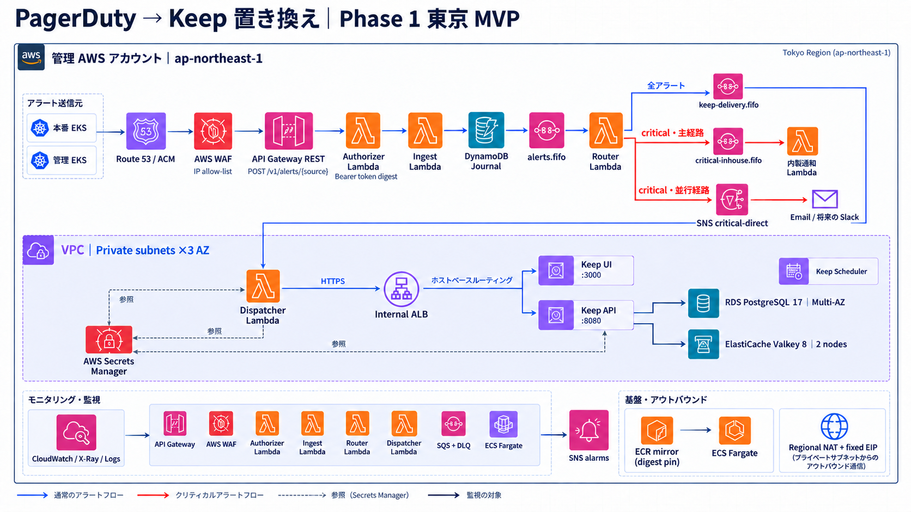

# terraform-pd

PagerDuty から Keep への置き換えのうち、**フェーズ 1（東京 MVP）** の IaC です。管理アカウント（ap-northeast-1）に次の 2 つを構築します。

- 受信パイプライン：API Gateway REST + WAF → Lambda → DynamoDB Journal / SQS FIFO → Keep
- Keep 基盤：ECS Fargate、RDS PostgreSQL、ElastiCache Valkey

- Keep のインフラを追加する理由（背景と so that）：[`docs/why-keep.md`](docs/why-keep.md)
- 計画書・前提確認・最終裁定：[`docs/implementation-plan.md`](docs/implementation-plan.md)
- 利用サービス、アラート通知までの流れ、Keep ソースでの裏取りと裁定：[`docs/architecture-services-and-flow.md`](docs/architecture-services-and-flow.md)
- 送信元（本番 / 管理 EKS）の設定：[`docs/alertmanager-receiver.md`](docs/alertmanager-receiver.md)
- critical アラートの直送（内製ツール / SNS）の契約：[`docs/critical-notification-contract.md`](docs/critical-notification-contract.md)
- critical 以外のアラート（Keep → SQS → 内製ツール）の契約：[`docs/non-critical-notification-contract.md`](docs/non-critical-notification-contract.md)
- コーディングエージェント（Claude Code）環境の設計と裁定：[`docs/agent-harness.md`](docs/agent-harness.md)（`CLAUDE.md`、`.claude/`）

## アーキテクチャ



図の「Regional NAT + 固定 EIP」は古い内容です。外向き通信は現在、共有 Transit Gateway 経由です（図は描き直す予定です）。

## 構成

```
modules/                       再利用モジュール（provider は設定しない。バージョンは下限のみ）
  network/                     VPC、private サブネット、共有 Transit Gateway への既定ルート、ゲートウェイエンドポイント、フローログ
  container_registry/          ECR（Keep イメージのミラー先）
  alert_journal/               DynamoDB AlertEventJournal（NEW_AND_OLD_IMAGES、削除保護）
  alert_queues/                SQS FIFO + DLQ
  nodejs_lambda_function/      Lambda（nodejs24.x / arm64）、IAM、ロググループ
  alert_ingress/               API Gateway REST（Regional）、REQUEST オーソライザ、WAF、カスタムドメイン
  keep_platform/               Keep（ECS、internal ALB、RDS、Valkey、Secrets）
  alert_monitoring/            パイプライン自体のアラーム
envs/management/ap-northeast-1/ ルートモジュール（provider とバージョン固定、ロックファイル）
  backend.hcl                  S3 backend の共通設定（use_lockfile）
  bootstrap/                   tfstate 用 S3 バケット
  foundation/                  network + container_registry
  keep/                        keep_platform、non-critical 用キュー（Keep → 内製ツール）
  alert-pipeline/              Journal、キュー（内製ツール用を含む）、Lambda ×4、ingress、SNS、監視
keep-workflows/                Keep ワークフローの YAML（Keep への反映は人が行う）
lambda/                        TypeScript + Effect（Node.js 24、pnpm、esbuild、vitest）
helpers/                       build-lambda.sh、mirror-keep-images.sh
```

## 必要なツール

| ツール | バージョン |
|---|---|
| Terraform | >= 1.16（CI は 1.16.4） |
| hashicorp/aws | ~> 6.66（ロック済み） |
| Node.js | 24（Lambda ランタイムは `nodejs24.x`） |
| pnpm | 12.6.0（`corepack enable` で `package.json` の `packageManager` を使う） |
| crane、aws CLI | イメージのミラーに使う |

## 適用手順（初回）

各ルートでは `terraform init -backend-config=../backend.hcl` を実行します。bootstrap の初回だけは例外です。値は各ルートの `terraform.tfvars`（プレースホルダ）を実環境の値に置き換えてください。

1. **bootstrap**（tfstate バケット）

   ```bash
   cd envs/management/ap-northeast-1/bootstrap
   mv backend.tf backend.tf.off && terraform init && terraform apply   # 初回はローカル state で作る
   mv backend.tf.off backend.tf && terraform init -backend-config=../backend.hcl -migrate-state
   ```

2. **foundation**：外向き通信は共有 Transit Gateway 経由です。VPC のアタッチメントはネットワーク側が作るので、2 回に分けて apply します。
   1. `transit_gateway_id = null` のまま `terraform apply` します（既定ルートはまだ作りません）。
   2. ネットワーク側に、VPC（出力 `vpc_id`、`private_subnet_ids`。AZ ごとに 1 サブネット）の共有 Transit Gateway へのアタッチメントと、Transit Gateway 側のルートの設定を依頼します。既定ルートを Transit Gateway に向けると、関連付けたルートテーブルにあるほかの VPC やオンプレミスにも届きうる（逆向きも）ので、このアタッチメント専用のルートテーブルもあわせて依頼します。中身は、集約出口への既定ルート、`operator_cidrs` への戻りのルート、私設アドレス（10.0.0.0/8、172.16.0.0/12、192.168.0.0/16。組織が使っていれば 100.64.0.0/10 も）のブラックホールルートだけで、ワークロード VPC からの伝播はなしです。専用のルートテーブルだけでは、私設アドレス宛てが集約出口の VPC で折り返してほかの VPC に届きうるので、ブラックホールルートが要ります（代わりに集約出口の側で落とす案もありますが、落とすかどうかは未確認です。詳細は [`docs/implementation-plan.md`](docs/implementation-plan.md) §14 R7）。
   3. アタッチメントが `available` になり、専用のルートテーブルに関連付いていて、その中身がちょうど上の 3 種類（ブラックホールルートも含む）であることを読み取りで確かめたら（手順は計画書 §14 R7）、`terraform.tfvars` の `transit_gateway_id` に `tgw-...` を設定して、もう一度 apply します。アタッチメントが無いと precondition でエラーになります。
   4. 外向きの IP は集約出口のもので、ネットワーク側が管理します。この IaC は出力しません。
   5. Keep のタスクは ECR API と Secrets Manager への外向き通信を必要とします（インターフェースエンドポイントは無い。[`docs/architecture-services-and-flow.md`](docs/architecture-services-and-flow.md) §3.1）。手順 4（keep）の前に、この手順 2 を終えてください。
3. **Keep イメージのミラー**：`helpers/mirror-keep-images.sh --version <tag> --account <id>` を実行し、表示された digest を `keep/terraform.tfvars` に設定します。
4. **keep**：`terraform apply`。
5. **Keep API キー**：Keep の UI で発行し、`aws secretsmanager put-secret-value --secret-id keep/api-key-dispatcher --secret-string <key>` で保存します。
   - あわせて、Keep に amazonsqs プロバイダ `inhouse-non-critical`（`sqs_queue_url` は keep の出力 `non_critical_inhouse_queue_url`）を登録し、`keep-workflows/non-critical-to-inhouse.yaml` を反映します（[`docs/non-critical-notification-contract.md`](docs/non-critical-notification-contract.md)）。
6. **Lambda のビルド**：`helpers/build-lambda.sh` で `lambda/dist/lambda.zip` を作ります（未ビルドのまま plan すると precondition でエラーになります）。
7. **alert-pipeline**：`terraform apply`。keep の出力（non-critical キューの名前）を読むので、keep を先に apply しておく必要があります。
8. **内製ツールの接続**：alert-pipeline の出力 `inhouse_notifier_queue_arn`（critical）と keep の出力 `non_critical_inhouse_queue_arn`（non-critical）を、内製ツール Lambda のイベントソースに設定します（[`docs/critical-notification-contract.md`](docs/critical-notification-contract.md)、[`docs/non-critical-notification-contract.md`](docs/non-critical-notification-contract.md)）。
9. **送信元の登録**：[`docs/alertmanager-receiver.md`](docs/alertmanager-receiver.md) の手順で、トークンの digest 登録と Alertmanager の receiver 追加を行います。

## 開発と検証

```bash
# Lambda
cd lambda && corepack enable && pnpm install && pnpm typecheck && pnpm test && pnpm build

# Terraform（リポジトリのルートで実行）
terraform fmt -check -recursive
for d in modules/* envs/*/*/*/; do terraform -chdir="$d" init -backend=false && terraform -chdir="$d" validate; done
terraform -chdir=modules/alert_ingress test          # tests/ があるディレクトリ（モックプロバイダ、AWS 資格情報は不要）
tflint --init && tflint --recursive --config "$PWD/.tflint.hcl"
checkov -d . --config-file .checkov.yaml
```

CI（`.github/workflows/ci.yml`）では、上記に加えて Lambda のビルド成果物（`lambda.zip`）をアップロードします。
