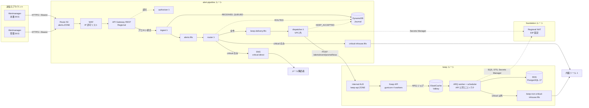
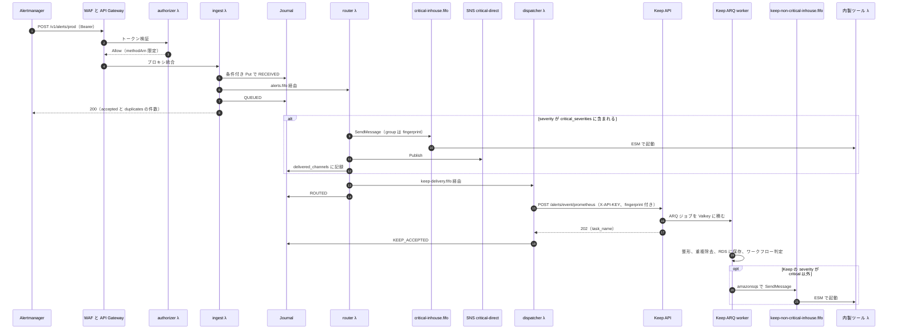

# 利用サービスとアラート通知までの流れ（フェーズ 1 東京 MVP）：Keep ソースでの裏取りと裁定

- 作成日: 2026-09-27
- 位置づけ: [`implementation-plan.md`](implementation-plan.md)（以下「計画書」）§3・§4 の構成を、サービスごとと流れごとに並べ直す。Keep に依存する前提は、同梱の Keep ソース（`keep/`、keephq/keep 0.54.3、`keep/pyproject.toml:3`）で裏取りし、最後に裁定する。作る理由と背景は [`why-keep.md`](why-keep.md) にある。
- 引用の書き方:
  - リポジトリ内のファイルは、ルートからの相対パスと行番号で書く（例：`keep/keep/api/routes/alerts.py:748-781`、`lambda/src/handlers/router.ts:31-60`）。`keep/` 以下は上流のソースで、編集しない。
  - Keep が使うライブラリは、`keep/poetry.lock` で固定された版の wheel を読んだ。「slowapi 0.1.9（keep/poetry.lock で固定）`slowapi/util.py:20-27`」の形で書く。
  - AWS の上限と API の仕様は「botocore 1.38.9 のサービスモデル」（同じく `keep/poetry.lock` で固定）で確かめた。
- 前提: Keep の事実はすべて v0.54.3 のものである。配備するイメージのタグが同じ挙動かは、計画書 §14 U15 のとおり未確認のまま。

---

## 1. 要約

- 利用サービスは 3 群に分かれる。受信と配送（Route 53、WAF、API Gateway REST、Lambda ×4、DynamoDB、SQS FIFO、SNS）、Keep 基盤（ECS Fargate、internal ALB、RDS、ElastiCache Valkey、Secrets Manager）、共通基盤（VPC と Regional NAT、ECR、CloudWatch、KMS、S3）である（§3）。
- critical は router から内製ツール用 SQS と SNS に直接送り、Keep を通らない。critical 以外は、Keep のワークフローが SQS 経由で内製ツールに送る（§4）。
- Keep ソースで C1〜C16 を確かめた。push API、認証、fingerprint の上書き、severity の境界、重複の扱い、SQS FIFO の属性は設計どおりだった。計画書 §14 の U1〜U4、U8、U11〜U14 は解消または縮小した（§5）。
- 一方で、Keep の設定と監視に 12 件のずれ（G1〜G12）があり、critical の router にも 1 件のずれ（G13：内製ツール用キューへの送信が失敗すると SNS にも送らない）がある。G11（`AWS_KMS_KEY_ID` が未設定だと Keep の secret 作成が失敗する）は、API キーの発行とプロバイダの登録を止める（§6）。
- **裁定：アーキテクチャは維持し、G1〜G13 の是正を条件に構築を進める（条件付き Go）**（§7）。

## 2. 全体像



- 実線は通知の流れ、点線は状態の記録と AWS API への出口を表す。Keep から SQS への送信は、インターフェースエンドポイントが無いので NAT を通る（§3.4）。
- 構成図（PNG）：[`architecture-phase1-tokyo.png`](architecture-phase1-tokyo.png)

## 3. 利用サービス

### 3.1 AWS のサービス

| サービス | 役割 | 定義場所 | なぜ使うか |
|---|---|---|---|
| Route 53 | パブリックゾーン（データソース）に、`alerts.<zone>`（API Gateway のカスタムドメイン）と `keep.<zone>` / `keep-api.<zone>`（internal ALB。private IP を返す）の A エイリアス、ACM の検証レコードを作る | `envs/management/ap-northeast-1/alert-pipeline/ingress.tf:1-4`、`modules/alert_ingress/domain.tf:10-21,46-56`、`modules/keep_platform/load_balancer.tf:25-36,129-141` | 送信元の URL を変えずに、フェーズ 3 でフェイルオーバーレコードに置き換えられる（計画書 §13） |
| ACM ×2 | `alerts.<zone>` 用（API Gateway）と、`keep.<zone>` + `keep-api.<zone>`（SAN）用（ALB）。DNS 検証 | `modules/alert_ingress/domain.tf:1-26`、`modules/keep_platform/load_balancer.tf:15-41` | TLS の終端（計画書 §4、§8） |
| WAF v2（REGIONAL） | 既定は BLOCK。送信元 NAT の IP セットだけ ALLOW。マネージドルールとレート制限は既定で COUNT。REST API のステージに関連付ける | `modules/alert_ingress/waf.tf:7-12,22-28,134-137` | Alertmanager は 4xx を再試行しないので、誤検知しうるルールは COUNT にする（計画書 §9、§2.2 事実 E・J） |
| API Gateway REST（Regional） | `POST /v1/alerts/{source}`。REQUEST オーソライザ、リソースポリシー（NotIpAddress で Deny）、execute-api エンドポイントの無効化、アクセスログ | `modules/alert_ingress/main.tf:7-21,23-57,77-105,146-172` | WAF を関連付けられるのは REST API のステージだけ（計画書 §2.2 事実 J） |
| Lambda ×4（`nodejs24.x` / arm64） | authorizer（10 秒）、ingest（29 秒）、router（30 秒。ESM のバッチ 10、最大同時 10）、dispatcher（60 秒。VPC 内、ESM のバッチ 5、最大同時は `dispatcher_maximum_concurrency` で既定 3、予約同時実行数 3） | `envs/management/ap-northeast-1/alert-pipeline/functions.tf:6-11,23-37,53-68,109-137,173-210` | 計画書 §7。dispatcher の同時実行数で Keep への流量を抑える（計画書 §2.2 事実 F） |
| DynamoDB | `AlertEventJournal`。`transition_id` をキーに条件付きで書き、状態は前進だけ。TTL、GSI `state-updated_at`、Streams（NEW_AND_OLD_IMAGES）、PITR、削除保護 | `modules/alert_journal/main.tf:9-67`、`lambda/src/lib/journal.ts:15,70-138` | 冪等性と再処理の拠り所（計画書 §4、§13） |
| SQS FIFO + DLQ | alert-pipeline ルートに `alerts`、`keep_delivery`、`critical_inhouse`。keep ルートに `non_critical_inhouse`。高スループット FIFO、SSE-SQS、`maxReceiveCount` 5、可視性タイムアウトは消費側 Lambda の 6 倍 | `modules/alert_queues/main.tf:5-47`、`modules/alert_queues/variables.tf:11-15`、`envs/management/ap-northeast-1/alert-pipeline/main.tf:43-58`、`envs/management/ap-northeast-1/keep/main.tf:53-61` | アラートごとの順序（`MessageGroupId` = fingerprint）、再試行と DLQ（計画書 §4、§4.2） |
| SNS | `alert-pipeline-critical-direct`（alias/aws/sns、メール購読）と、監視用の `alert-pipeline-alarms`（KMS の CMK で暗号化） | `envs/management/ap-northeast-1/alert-pipeline/main.tf:87-98`、`modules/alert_monitoring/main.tf:38-49` | critical を Keep に依存せず並行して送る（計画書 §4.1 案 A）。パイプライン自体の監視通知（計画書 §10） |
| KMS | 監視トピック用の CMK（キーのローテーション有効）。そのほかは AWS マネージドキー | `modules/alert_monitoring/main.tf:8-36` | CMK はここだけ。ログや Secrets の CMK 化はフェーズ 2（計画書 §9） |
| Secrets Manager | `alert-pipeline/source-token-digests`（運用者が digest を書く）、`keep/` 配下の生成値 4 つ（write-only で生成）、`keep/api-key-dispatcher`（運用者が書く）。Keep 自身も `keep_*` / `keep-*` を作る（C7） | `envs/management/ap-northeast-1/alert-pipeline/main.tf:100-105`、`modules/keep_platform/secrets.tf:5-26` | 秘密値を plan と state に残さない（計画書 §5、§8） |
| VPC、private サブネット、IGW、Regional NAT + EIP、ゲートウェイエンドポイント（s3、dynamodb）、フローログ | Keep と dispatcher の置き場所。インターフェースエンドポイントは無いので、Secrets Manager、SQS、SNS、STS、CloudWatch Logs、ECR API への通信は NAT を通る | `modules/network/main.tf:3-11,18-37,42-71,94-105`、`modules/network/variables.tf:33-37`、`modules/network/flow_logs.tf:46-53` | egress IP を固定し、外部の許可リストに登録できる（計画書 §6.1） |
| ECR | `keep/keep-api`、`keep/keep-ui`（IMMUTABLE、KMS、スキャン） | `modules/container_registry/main.tf:3-16`、`envs/management/ap-northeast-1/foundation/main.tf:12-16` | 上流の GAR は ECR のプルスルーキャッシュの対象外（計画書 §2.2 事実 G） |
| ECS Fargate | クラスタ `keep`（Container Insights enhanced）。サービスは api（既定 2 タスク）、任意の scheduler（1 タスク、min 0% / max 100%）、ui（1 タスク） | `modules/keep_platform/main.tf:52-69`、`modules/keep_platform/services.tf:1-31,42-120,124-187` | 計画書 §8 |
| ALB（internal） | HTTPS 443（`ELBSecurityPolicy-TLS13-1-2-2021-06`）。ホスト名で振り分ける：`keep-api.<zone>` → api:8080（ヘルスチェック `/healthcheck`、200）、`keep.<zone>` → ui:3000（`/`、200-399） | `modules/keep_platform/load_balancer.tf:5-13,43-127` | UI と API を外部に公開しない（計画書 §8） |
| RDS for PostgreSQL 17 | Keep の状態（アラート、ワークフロー、実行履歴）。Multi-AZ、`rds.force_ssl=1`、削除保護 | `modules/keep_platform/data_stores.tf:8-61` | フェーズ 3 のクロスリージョンレプリカの元（計画書 §8） |
| ElastiCache（Valkey 8.0） | Keep の ARQ キュー。2 ノード、自動フェイルオーバー、保存時の暗号化。通信の暗号化は無効 | `modules/keep_platform/data_stores.tf:70-91` | `REDIS=true` で push を非同期に処理する（C1、計画書 §8） |
| CloudWatch（Logs、アラーム） | Lambda、API Gateway、WAF、ECS コンテナのログ。アラームはキューの滞留 ×4、DLQ ×4、Lambda の Errors ×4、dispatcher の Throttles、API の 4XX / 5XX、WAF のブロック、ECS の稼働タスク数 | `modules/alert_monitoring/main.tf:55-181`、`envs/management/ap-northeast-1/alert-pipeline/monitoring.tf:1-41`、`modules/keep_platform/services.tf:33-38` | 監視する側の監視（計画書 §10）。不足は G3、G12 |
| X-Ray | API ステージのトレース | `modules/alert_ingress/main.tf:150` | 受信口の遅延の調査 |
| STS | Keep の amazonsqs プロバイダが、登録時の検証で `GetCallerIdentity` を呼ぶ。NAT 経由 | `keep/keep/providers/amazonsqs_provider/amazonsqs_provider.py:180-198` | Terraform では定義しない。インターフェースエンドポイントが無いので NAT が要る |
| S3 | tfstate バケット（`use_lockfile`） | `envs/management/ap-northeast-1/bootstrap/main.tf:4-10`、`envs/management/ap-northeast-1/backend.hcl` | 計画書 §5 |
| IAM | Lambda ごとのインラインポリシー、ECS の実行ロール（注入する secret だけ読む）、タスクロール（Keep の secret と送信専用の SQS） | `envs/management/ap-northeast-1/alert-pipeline/functions.tf:16-21,41-51,72-107,156-171`、`modules/keep_platform/iam.tf:20-95` | 最小権限（計画書 §9）。過剰な点は G5 |

### 3.2 Keep の内部構成要素

api の各タスクは `keep-backend` コンテナ 1 つで、次の要素がその中で動く（UI だけは別サービス）。

| 構成要素 | 役割 | 定義場所 | 設計との関係 |
|---|---|---|---|
| `entrypoint.sh` | `REDIS=true` なら ARQ 用 gunicorn（既定 2 workers、:8001）を起動し、5 秒後に API 用 gunicorn を `SKIP_DB_CREATION=true` で起動する。どちらかが終了するとコンテナごと終了する。`server_jobs_bg.py` もバックグラウンドで起動する | `keep/keep/entrypoint.sh:12,21-75`、`keep/docker/Dockerfile.api:70,72` | タスク定義は command / entryPoint を上書きしない（`modules/keep_platform/services.tf:58-80`）ので、この形で動く（C4） |
| API gunicorn | UvicornWorker ×4 を :8080 に固定で立てる（`PORT` は bind に効かない）。`KEEP_USE_LIMITER=true` なら SlowAPIMiddleware を入れる | `keep/docker/Dockerfile.api:72`、`keep/keep/api/api.py:357-359` | push API の受け口（C1）。制限の単位は G2 |
| ARQ worker gunicorn | ARQ ワーカー ×2 が `process_event_in_worker` を処理する。master は起動時に `alembic upgrade head` を実行する | `keep/keep/entrypoint.sh:31-54`、`keep/keep/api/arq_worker.py:69-121`、`keep/keep/api/config.py:47-51` | 移行の同時実行は G8 |
| WorkflowManager / WorkflowScheduler | 起動したプロセスごとに 1 秒周期のループを持つ。アラート起動の実行はメモリ上の実行待ちリストから取り出し、interval ワークフローは DB の一意制約で排他する。ARQ ワーカーは常に起動し、API プロセスは `SCHEDULER` が true のときだけ起動する | `keep/keep/workflowmanager/workflowscheduler.py:84,87-89,649-671`、`keep/keep/api/arq_worker_gunicorn.py:87-91`、`keep/keep/api/api.py:81,133-140` | 1 タスクに最大 6 ループ（API 4 + ARQ 2）。G1 |
| prometheus プロバイダ | Alertmanager v4 の本文を AlertDto にする。ラベルのキーを小文字にし、severity を対応表で変換し、`lastReceived` に受信時刻を入れる | `keep/keep/providers/prometheus_provider/prometheus_provider.py:76-90,176-236` | critical の境界（C8） |
| AlertDeduplicator | 既定ルールでは、`lastReceived` を除いた AlertDto の sha256 を fingerprint ごとの直前の値と比べる。同じなら完全重複としてワークフローの前で除く | `keep/keep/api/alert_deduplicator/alert_deduplicator.py:61-104,260-290`、`keep/keep/api/tasks/process_event_task.py:424-445` | repeat への対策（C9） |
| amazonsqs プロバイダ | ワークフローのアクションから SQS に送る。FIFO なら group_id と dedup_id が必須。登録・更新・再検証でテストメッセージを送る。`start_consume` を持つ | `keep/keep/providers/amazonsqs_provider/amazonsqs_provider.py:173-225,242-285,310-358` | non-critical の出口（C10） |
| EventSubscriber | `CONSUMER=true` なら API の各ワーカーで起動し、consumer 型のプロバイダ（amazonsqs など）の消費を始める | `keep/keep/api/api.py:82,142-153` | 本設計では不要（G6） |
| AwsSecretManager | `SECRET_MANAGER_TYPE=AWS` のとき、プロバイダ設定、API キー、ワークフローの secret を Secrets Manager に置く。新規作成では `KmsKeyId` に `AWS_KMS_KEY_ID` を渡す | `keep/keep/secretmanager/awssecretmanager.py:20-26,46-142,144-212` | G5、G11 |
| `server_jobs_bg.py` | API の起動を待ってから、デモモードと PostHog への稼働報告（1 時間ごと）のスレッドを起動する | `keep/keep/server_jobs_bg.py:12-38`、`keep/keep/api/core/report_uptime.py:16,21-60` | 外部への送信（G7） |
| Keep UI（別サービス、:3000） | Next.js。サーバ側から `API_URL`（`keep-api.<zone>`）を呼ぶ | `keep/docker/Dockerfile.ui:65-73`、`modules/keep_platform/main.tf:41-49` | 運用者の手作業（API キー、プロバイダ、ワークフロー）と状態の手動変更（C15） |

### 3.3 外部の関係者

| 関係者 | 役割 | 定義・根拠 | 備考 |
|---|---|---|---|
| Alertmanager（本番 EKS、管理 EKS） | webhook（v4）を `Authorization: Bearer` 付きで送る。`send_resolved: true`。5xx だけ再試行し、429 を含む 4xx は再試行しない | `docs/alertmanager-receiver.md:37-59`、計画書 §2.2 事実 E | receiver の追加は計画書 §6.2 の順 6。PagerDuty 用の receiver は残す |
| 内製ツール λ | `critical-inhouse.fifo` と `keep-non-critical-inhouse.fifo` を ESM で消費し、`labels.system` でルームを決める（無ければフォールバック） | `docs/critical-notification-contract.md:47,58-59`、`docs/non-critical-notification-contract.md:57-75` | 別リポジトリ。重複は `transitionId` / 重複排除キーで除く |
| メール購読者 | SNS critical-direct のメールを受ける | `envs/management/ap-northeast-1/alert-pipeline/main.tf:92-98` | critical の並行経路 |
| 運用者 | internal ALB 経由の Keep UI で手作業（API キー、プロバイダ、ワークフロー）を行う。トークンの digest 登録、DLQ の redrive も行う | `envs/management/ap-northeast-1/keep/main.tf:26-27`、README の適用手順 4〜9 | 手作業 4 / 4a は G11 で止まる |
| PagerDuty | フェーズ 3 まで、既存の receiver で並行して動く | 計画書 §15 付記 | 取りこぼしの突き合わせ先（§7 so that ③） |

### 3.4 使わないもの

| 使わないもの | 理由 | 根拠 |
|---|---|---|
| Keep の pull（プロバイダからの定期取得） | push だけにする。pull はワークフローを通らない | `modules/keep_platform/main.tf:28-29`（`KEEP_PULL_DATA_ENABLED=false`） |
| Pusher / websocket | サーバを置かない。UI の自動更新は無くなるが、UI は動く。無効化の設定は G7 | `keep/keep/api/core/dependencies.py:52-65`、`keep/keep-ui/utils/hooks/usePusher.ts:15-20` |
| インターフェース VPC エンドポイント | ゲートウェイエンドポイント（s3、dynamodb）だけを置く。ほかの AWS API は NAT 経由 | `modules/network/main.tf:94-98`、`modules/network/variables.tf:33-37` |
| SNS FIFO、EventBridge | 2 経路の独立と順序のため（計画書 §4.1 案 B / D） | 計画書 §4.1 |
| PagerDuty の SNS 連携 | 選択肢に入れない | 計画書 §15 付記 |

## 4. アラート通知までの流れ

### 4.1 シーケンス（firing）



### 4.2 手順ごとの処理

| # | 処理 | 成功時の結果 | Journal の状態 | 失敗時 | 根拠 |
|---|---|---|---|---|---|
| S1 | WAF（IP 許可リスト）→ リソースポリシー（NotIpAddress で Deny）→ REQUEST オーソライザ（sha256(トークン) を送信元ごとの digest と比べる。判定は 300 秒キャッシュ） | 認可されたリクエストだけが ingest に届く | なし | 4xx。Alertmanager は再試行しない | `modules/alert_ingress/waf.tf:22-28`、`modules/alert_ingress/main.tf:23-57,77-84`、`modules/alert_ingress/variables.tf:40-44`、`lambda/src/handlers/authorizer.ts:15-62` |
| S2 | ingest が本文を v4 として検証する。アラートごとに transitionId（source・fingerprint・status・startsAt の sha256）で Journal に条件付き Put し、alerts.fifo に送る（group は `<source>:<fp>`、dedup は transitionId）。既にあり、状態が RECEIVED 以外なら duplicate として送らない | 200 と件数 | RECEIVED → QUEUED | 送信元の不一致は 403、不正な本文は 400（再試行されない）。AWS の障害は 500（再試行され、RECEIVED のものは再キューされる） | `lambda/src/handlers/ingest.ts:28-87`、`lambda/src/lib/transition-id.ts:9-16`、`lambda/src/lib/journal.ts:70-103` |
| S3 | router が severity（`labels.severity`、無ければ `unknown`）を見る。`critical_severities` に含まれれば、内製ツール用キュー → SNS の順に送り、成功した経路を `delivered_channels` に記録する（再試行では未送信の経路だけ送る）。その後、全件を keep-delivery.fifo に送る | 経路ごとの送信記録 | QUEUED → ROUTED | レコード単位の失敗は、以降のレコードも含めて batchItemFailures で返す。180 秒後に再配信、5 回で alerts の DLQ | `lambda/src/handlers/router.ts:31-60`、`lambda/src/lib/fifo-batch.ts:12-28`、`lambda/src/lib/journal.ts:140-171` |
| S4 | dispatcher が API キーを Secrets Manager から読み（5 分キャッシュ）、`POST {KEEP_API_URL}/alerts/event/prometheus?fingerprint=<source>:<fp>` を X-API-KEY 付きで送る（タイムアウト 10 秒）。本文は 1 アラートだけの v4 で、ラベル `alert_source` を足す | 200 / 202。`keep_task_name` を記録 | ROUTED → KEEP_ACCEPTED | 429、5xx、タイムアウトは batchItemFailures。360 秒後に再配信、5 回で keep-delivery の DLQ | `lambda/src/handlers/dispatcher.ts:15-44`、`lambda/src/lib/keep-client.ts:28-61`、`lambda/src/lib/secrets.ts:12-33` |
| S5 | Keep API が認証（Bearer があれば JWT として先に検証し、次に X-API-KEY / `?api_key`）、スコープ `write:alert`、レート制限（有効時）を通す。`REDIS=true` なら ARQ ジョブを Valkey に積む | 202 と `task_name`（ARQ のジョブ ID） | KEEP_ACCEPTED は「Valkey に積んだ」を表す | 401 / 403（キー、スコープ）、429（レート制限）、400（プロバイダ名、本文）、500（Valkey の障害など） | `keep/keep/identitymanager/authverifierbase.py:168-180,260`、`keep/keep/api/routes/alerts.py:685-781`、`keep/keep/api/api.py:343-359` |
| S6 | ARQ の `process_event_in_worker` が、prometheus プロバイダで整形 → `?fingerprint=` で上書き → 重複判定（完全重複はここで除く）→ RDS に保存 → `insert_events` で CEL を評価し、該当するワークフローをメモリ上の実行待ちに積む | アラートが RDS に入り、実行待ちに積まれる | 追跡しない | 例外は ARQ の Retry（遅延は試行回数 × 5 秒）。最大 5 回で破棄し、エラーとして AlertRaw に残す | `keep/keep/api/arq_worker.py:69-121`、`keep/keep/api/tasks/process_event_task.py:107-108,424-458,538-545,831-858`、`keep/keep/workflowmanager/workflowmanager.py:404-459,586-595`、arq 0.26.3（keep/poetry.lock で固定）`arq/worker.py:208,544-556` |
| S7 | scheduler の 1 秒ループが実行待ちを取り出し、実行行を作ってスレッドプールで動かす。`with` をレンダリング（chevron → `html.unescape` → `keep.` 関数の抽出）し、amazonsqs の `_notify` で SendMessage する（group は fingerprint、dedup は `<fingerprint>:<status>:<lastReceived>`） | キューにメッセージが入る | 追跡しない（実行行の status が success / error になる） | レンダリングと送信の失敗は、実行行が error になる。再試行は `on-failure.retry` を書いたときの notify だけ | `keep/keep/workflowmanager/workflowscheduler.py:264-280,408-413,495-522,632-671`、`keep/keep/step/step.py:343-387`、`keep/keep/iohandler/iohandler.py:212-249,650-684`、`keep-workflows/non-critical-to-inhouse.yaml:18-29` |
| S8 | 内製ツールが、critical は `transitionId`、non-critical は重複排除キーで重複を除き、`labels.system` でルームを決める（無ければフォールバック） | 人に届く | なし | ツールの処理失敗は 5 回で各キューの DLQ | `docs/critical-notification-contract.md:47,58-59`、`docs/non-critical-notification-contract.md:53,57-61,70-75` |

- 可視性タイムアウトは alerts が 180 秒（6 × 30 秒）、keep-delivery が 360 秒（6 × 60 秒）である（`envs/management/ap-northeast-1/alert-pipeline/main.tf:49-51`）。
- Keep の中（S6 以降）は Journal では追えない。追跡は Keep のワークフロー実行履歴とログで行う（G3）。

### 4.3 ケースごとの結果

| ケース | critical 経路（router） | Keep 経路 | 結果 | 根拠 |
|---|---|---|---|---|
| critical の firing | 内製ツール用キューと SNS に送る | CRITICAL として保存する。CEL `severity != "critical"` に合わないので、ワークフローは動かない | 内製ツールとメールに届く（経路ごとに at-least-once） | `lambda/src/handlers/router.ts:52`、`keep/keep/providers/prometheus_provider/prometheus_provider.py:205-207`、`keep/keep/api/utils/cel_utils.py:11-40` |
| critical 以外の firing | 送らない | ワークフローが keep-non-critical-inhouse.fifo に送る | 内製ツールに 1 回届く | `keep-workflows/non-critical-to-inhouse.yaml:18-29` |
| resolved | critical は新しい transitionId として両経路に送る | critical は保存するだけ（CEL が除く）。critical 以外は状態が変わる（部分重複）のでワークフローが動き、resolved を送る | critical の resolved は router からだけ、critical 以外の resolved は Keep からだけ届く | `lambda/src/lib/transition-id.ts:9-10`、`keep/keep/api/alert_deduplicator/alert_deduplicator.py:81-104` |
| Alertmanager の再送（`repeat_interval`、同じグループの別アラートの変化による再送） | 同じ startsAt なので transitionId が同じ。ingest が duplicate として送らない | 届かない。届いても完全重複として除かれる | 再通知されない（U12 は解消） | `lambda/src/lib/transition-id.ts:4-10`、`lambda/src/handlers/ingest.ts:48,71`、`keep/keep/api/tasks/process_event_task.py:440-445` |
| firing 中に annotations だけが変わる | ingest が duplicate として送らない | 届かない | 変更は通知されない。transitionId の設計上の割り切り | `lambda/src/lib/transition-id.ts:9-10`、`lambda/src/handlers/ingest.ts:71` |
| `severity` ラベルが無い | `unknown` になり critical ではない | INFO になる | critical 以外の経路で届く | `lambda/src/handlers/ingest.ts:50`、`keep/keep/providers/prometheus_provider/prometheus_provider.py:205-207` |
| 値が大文字（`severity="Critical"`） | 完全一致しないので critical ではない | 対応表に無いので INFO | critical 以外の経路で届く（両側で一致する） | `lambda/src/handlers/router.ts:52`、`keep/keep/providers/prometheus_provider/prometheus_provider.py:76-84` |
| ラベル名が大文字（`Severity="critical"`） | `labels.severity` が無いので `unknown`。critical ではない | キーを小文字にするので `severity=critical` として CRITICAL。CEL に合わない | **どちらの経路にも届かない**。送信元のラベル名を `severity` にそろえる（§6.13 F13） | `lambda/src/handlers/ingest.ts:50`、`keep/keep/providers/prometheus_provider/prometheus_provider.py:197,205-207` |
| Keep UI での状態の手動変更（C15） | 関係しない | API プロセスで `insert_events` に積まれる。critical 以外なら `acknowledged` などの状態で送る。API プロセスで scheduler が動いているときだけ実行される（G1） | 内製ツールに Alertmanager 以外の状態が届く | `keep/keep/api/bl/enrichments_bl.py:606-623`、`keep/keep/api/routes/alerts.py:1008-1013` |
| Journal の TTL（既定 30 日）の後も firing が続く | 項目が消えた後の再送は新規として受け付け、critical なら同じ transitionId で両経路に再送する | 内容が同じなら完全重複として除く | critical は約 30 日ごとに再通知されうる（内製ツールは重複排除の保持期間しだい、メールは再送される）。TTL で項目が消える時期は DynamoDB 側の処理で未確認 | `envs/management/ap-northeast-1/alert-pipeline/variables.tf:89-93`、`lambda/src/lib/journal.ts:52,70-103`、`lambda/src/handlers/ingest.ts:71` |
| Keep のスコープ検証メッセージ | 関係しない | プロバイダの登録、更新、手動の再検証のときに、本文 `KEEP_SCOPE_TEST_MSG_PLEASE_IGNORE`、group `keep` を送る | 内製ツールが処理せずに削除する（契約） | `keep/keep/providers/amazonsqs_provider/amazonsqs_provider.py:200-205`、`docs/non-critical-notification-contract.md:66` |

### 4.4 失敗、再試行、DLQ

アラーム名の接頭辞 `alert-pipeline-` は省く（`modules/alert_monitoring/main.tf:58,76,94,112,130,146,168`）。

| 失敗 | 何が起きるか | 検知 | 根拠 |
|---|---|---|---|
| WAF のブロック、オーソライザの Deny、ingest の 400 / 403 | 4xx。Alertmanager は再試行しないので、その通知は欠落する | `waf-blocked-requests`、`api-client-errors` | `modules/alert_monitoring/main.tf:127-163`、`lambda/src/handlers/ingest.ts:31-40` |
| ingest での AWS の障害（DynamoDB、SQS） | 500。Alertmanager が再送し、RECEIVED のものは再キューされる | `api-server-errors`（応答として 500 を返すので、`ingest-errors` は増えない） | `lambda/src/handlers/ingest.ts:83-87` |
| router の送信失敗（内製ツール用キュー、SNS、keep-delivery、Journal） | そのレコード以降を batchItemFailures で返す。180 秒ごとに再配信し、5 回受信（約 15 分）で alerts の DLQ。内製ツール用キューへの送信が失敗している間は、同じレコードの SNS も送らない（順に送るため。G13） | `alerts-oldest-message-age`（300 秒超が 5 分続く）、`alerts-dlq-not-empty`。**`router-errors` は鳴らない**（G12） | `lambda/src/handlers/router.ts:35-45`、`lambda/src/lib/fifo-batch.ts:17-24`、`envs/management/ap-northeast-1/alert-pipeline/monitoring.tf:8` |
| 内製ツール Lambda の停止（critical） | キューへの送信は成功するので、SNS には届く | `critical_inhouse-oldest-message-age`（120 秒） | `docs/critical-notification-contract.md:71` |
| dispatcher：Keep の 429 / 5xx、10 秒のタイムアウト、ALB に届かない | batchItemFailures。360 秒ごとに再配信し、5 回受信（約 30 分）で keep-delivery の DLQ。Journal は ROUTED のままなので、GSI で抽出して再投入できる | `keep_delivery-oldest-message-age`（900 秒）、`keep_delivery-dlq-not-empty`、`keep-api-running-tasks`。**`dispatcher-errors` は鳴らない**（G12） | `lambda/src/handlers/dispatcher.ts:35-44`、`lambda/src/lib/keep-client.ts:42-57`、`envs/management/ap-northeast-1/alert-pipeline/monitoring.tf:9` |
| Keep：202 の後、ARQ の処理が失敗する | ARQ が最大 5 回まで再試行し、その後は破棄する | 検知できない（G3） | `keep/keep/api/tasks/process_event_task.py:831-858`、arq 0.26.3（keep/poetry.lock で固定）`arq/worker.py:208,544-556` |
| Keep：処理の後、実行前にタスクが止まる（デプロイ、スケールイン、クラッシュ） | メモリ上の実行待ちが消える（G3 (a)） | 検知できない | `keep/keep/workflowmanager/workflowmanager.py:586-595`、`keep/keep/workflowmanager/workflowscheduler.py:408-413` |
| ワークフローのアクションの失敗（SQS への送信失敗など） | 実行行が error になる。`on-failure.retry` が無いので再試行しない（G3 (b)） | 検知できない | `keep/keep/step/step.py:353-387`、`keep/keep/workflowmanager/workflow.py:137-145` |
| プロバイダの未登録、名前違い | WARNING ログだけで、実行行も作らない（G3 (c)） | 検知できない | `keep/keep/workflowmanager/workflowmanager.py:106-113,305-310` |
| レンダリングの失敗（`keep.` と括弧を含む値、キーの欠落） | アクションが失敗する。レンダリングは再試行の対象外（G4） | 検知できない | `keep/keep/step/step.py:343-347`、`keep/keep/iohandler/iohandler.py:212-249,487-500` |
| 内製ツールの処理失敗（critical 以外） | 5 回受信で `keep-non-critical-inhouse-dlq.fifo` | `non_critical_inhouse-dlq-not-empty`、`non_critical_inhouse-oldest-message-age` | `docs/non-critical-notification-contract.md:75,99-102` |

- Keep の中の失敗（上の表で「検知できない」の 5 行）は、既存のアラームでは見えない（`docs/non-critical-notification-contract.md:104`）。critical の配送には影響しない。

## 5. Keep ソースでの裏取り

### 5.1 確かめた事実

| # | 事実 | 根拠 | 設計への影響 |
|---|---|---|---|
| C1 | `POST /alerts/event/{provider_type}`（接頭辞 `/alerts`）は 202 を返す。`REDIS` が小文字の `true` と完全一致すると、ARQ ジョブを Valkey に積んだ時点で `{"task_name": ジョブ ID}` を返す | `keep/keep/api/api.py:295`、`keep/keep/api/routes/alerts.py:85,685-699,748-781` | `KEEP_ACCEPTED` は「Keep の Valkey に積んだ」を意味し、永続化や通知の完了ではない（U8 解消） |
| C2 | クエリの `fingerprint` は、本文の全アラートの fingerprint を上書きする | `keep/keep/api/tasks/process_event_task.py:107-108,809-810` | dispatcher は 1 リクエストに 1 アラートで送る（`lambda/src/handlers/dispatcher.ts:15-27`）ので問題ない |
| C3 | Bearer があれば JWT として先に検証し、不正なら 401 になる（X-API-KEY があっても同じ）。API キーは X-API-KEY ヘッダか `?api_key` で渡す。このルートはスコープ `write:alert` を要求する。webhook ロールは `write:alert`、`write:incident` を持ち、admin は `write:*` で通る。noc と workflowrunner は通らない | `keep/keep/identitymanager/authverifierbase.py:21,168-180,260`、`keep/keep/identitymanager/identity_managers/db/db_authverifier.py:16-39`、`keep/keep/api/routes/alerts.py:697-699`、`keep/keep/identitymanager/rbac.py:34-75` | dispatcher は X-API-KEY で送る（`lambda/src/lib/keep-client.ts:46`）。最小権限のため、dispatcher の API キーは webhook ロールで発行する（§6.13 F13） |
| C4 | `REDIS=true` では、エントリポイントが ARQ ワーカーと API を同じコンテナで起動し、片方が終わるとコンテナが終了する | `keep/keep/entrypoint.sh:12,21-75`、`keep/docker/Dockerfile.api:70,72`、`modules/keep_platform/services.tf:58-80` | タスク定義はコマンドを上書きしないので、ARQ ワーカーは api の各タスクで動く。止まれば ECS が入れ替える |
| C5 | `GET /healthcheck` は認証なしで `{}` と 200 を返し、何も検査しない | `keep/keep/api/routes/healthcheck.py:6-14`、`keep/keep/api/api.py:294` | ALB のヘルスチェックはこのままでよい（U3 解消）。UI は G9 |
| C6 | 初期管理者の変数名は `KEEP_DEFAULT_USERNAME` / `KEEP_DEFAULT_PASSWORD` | `keep/keep/api/core/db_on_start.py:48-49` | 計画書の変数名は正しい（U2 解消） |
| C7 | Keep が作る secret の名前（テナントは `keep`）は、プロバイダ `keep_<type>_<id>`、ワークフロー `keep_<workflow_id>_secrets`、API キー `keep-<reference_id>`、SMTP `keep_smtp` | `keep/keep/providers/providers_service.py:127,191,417`、`keep/keep/contextmanager/contextmanager.py:140`、`keep/keep/api/utils/tenant_utils.py:87,136`、`keep/keep/api/core/db_on_start.py:147`、`keep/keep/api/routes/settings.py:98`、`keep/keep/api/core/dependencies.py:14` | タスクロールの `secret:keep*` に一致する（U4 解消）。IaC 自身の `keep/` 配下にも一致する（G5） |
| C8 | severity は `labels.severity` の値で決まり、大文字と小文字を区別する。critical → CRITICAL、error / high → HIGH、warning / medium → WARNING、info → INFO、low → LOW、それ以外と欠落は INFO。CEL の `severity != "critical"` は `severity != 5` に書き換えて評価する | `keep/keep/providers/prometheus_provider/prometheus_provider.py:76-84,197,205-207`、`keep/keep/api/utils/cel_utils.py:6-40`、`keep/keep/api/models/alert.py:40-45`、`keep/keep/workflowmanager/workflowmanager.py:404,432-443` | 既定の `critical_severities=["critical"]` と境界が一致する（§4.3） |
| C9 | ingest は同じ transition の再送を duplicate として送らない。Keep は既定ルール（`lastReceived` を除いた sha256）で完全重複をワークフローの前で除く | `lambda/src/handlers/ingest.ts:71`、`keep/keep/api/tasks/process_event_task.py:424-445`、`keep/keep/api/alert_deduplicator/alert_deduplicator.py:61-104,260-290` | Alertmanager の再送でワークフローは起動しない。`only_on_change` は不要（U12 解消） |
| C10 | amazonsqs は、キュー URL が `.fifo` なら group_id と dedup_id を必須とし、`MessageGroupId` / `MessageDeduplicationId` に入れる。送信の例外は再送出する。`validate_scopes` は STS の `GetCallerIdentity` と実メッセージの送信を行う。呼び出し元は登録（`POST /providers/install`、OAuth2 での登録）、更新（`PUT /providers/{id}`）、手動の再検証（`POST /providers/{id}/scopes`）だけで、定期的な呼び出しは無い。プロビジョニングは `validate_scopes=False` で呼ぶ。UI は空欄の項目を送らないので、アクセスキーを空欄にすると既定の資格情報（タスクロール）を使う。API で空文字を明示すると、空の資格情報で署名する | `keep/keep/providers/amazonsqs_provider/amazonsqs_provider.py:163-205,242-285,310-313`、`keep/keep/providers/providers_service.py:153,179-180,290,372-392,582,662`、`keep/keep/api/routes/providers.py:387-419,470-534,537-578`、`keep/keep-ui/app/(keep)/providers/provider-form.tsx:248-255`、botocore 1.38.9（keep/poetry.lock で固定）`botocore/session.py:953-961` | テストメッセージは定期的には送られない（U13 解消）。プロバイダは UI で登録し、アクセスキーは空欄にする |
| C11 | interval ワークフローの排他は、一意制約 (workflow_id, execution_number, is_running, timeslot) による。timeslot は 120 秒単位で、is_running は実行中だけ 1、終了すると乱数になる。二重実行を防げるのは、同じ timeslot の中で先の実行がまだ走っている間だけ | `keep/keep/api/models/db/workflow.py:77-79,134-137`、`keep/keep/api/models/db/migrations/versions/2024-07-11-17-10_54c1252b2c8a.py:387-389`、`keep/keep/api/core/db.py:285-299,322-442,983` | 排他はベストエフォートである。実行が timeslot の境界をまたぐとき、または別プロセスの読み取りと挿入の間に実行が終わったとき、まれに二重実行しうる（コードからの推論で、再現はしていない）。完了条件 6 を見直す（G1） |
| C12 | `lastReceived` は AlertDto の validator が ms 付き UTC の `…Z` に正規化する。プロバイダは受信時刻を isoformat で渡す | `keep/keep/api/models/alert.py:175-206`、`keep/keep/providers/prometheus_provider/prometheus_provider.py:214-216` | dedup_id の文字は英数字と `:-.TZ` に収まる |
| C13 | `REDIS_SSL`（既定 false）があり、`ssl=` として arq に渡す。arq の既定は、証明書の検証が required、CA の指定なし、ホスト名の検証なし | `keep/keep/api/redis_settings.py:33,55,67`、arq 0.26.3（keep/poetry.lock で固定）`arq/connections.py:37-43` | TLS は使える（U1 一部解消）。ElastiCache の証明書をイメージの CA ストアで検証できるかは未確認 |
| C14 | SQS の SendMessage では、`MessageGroupId` と `MessageDeduplicationId` は 128 文字以内の英数字と記号、`MessageBody` は 256 KiB 以内。Keep の AlertStatus で最長の値は `acknowledged`（12 文字） | botocore 1.38.9 のサービスモデル（`sqs` の SendMessage）、`keep/keep/api/models/alert.py:48-60` | `dedup_id` は `<source>` の長さ + 55 文字以内（fingerprint の 16 桁 hex は計画書 §14 U14 によるもので、prometheus/common では再確認していない）（U14 解消） |
| C15 | UI / API による `status` の変更は、ワークフローを再び起動する。起動は API プロセスで `insert_events` に積まれる | `keep/keep/api/bl/enrichments_bl.py:606-623`、`keep/keep/api/routes/alerts.py:1008-1013` | 内製ツールに `acknowledged` などの状態が届く。API プロセスで scheduler が動いている必要がある（G1） |
| C16 | 認証を外す、または弱める主なスイッチは次の 5 つである。(a) `AUTH_TYPE` の Keep の既定は `noauth` で、`NoAuthVerifier` は任意の Bearer トークンと任意の API キー（登録の無いものも含む）を Admin として通す。旧名の `NO_AUTH` も noauth に読み替える。`oauth2proxy` は、クライアントが送る `x-forwarded-email` / `x-forwarded-groups` ヘッダをそのまま信じ、ユーザーも作る。(b) `KEEP_CLOUDWATCH_DISABLE_API_KEY` は cast なしで読むので、`"false"` を含む空でない値はすべて有効になる。有効だと、User-Agent で SNS を名乗るだけで API キーなしに `/alerts/event/cloudwatch` へ投入でき、テナントはクエリで選べる。(c) `KEEP_ALLOW_MESH_ALERT_INGESTION` が `"true"` と一致すると、API キーの無い `/alerts/event` を webhook ロールで通す。(d) `KEEP_IMPERSONATION_ENABLED` が `"true"` と一致すると、admin の API キーを持つ者が `X-KEEP-USER` / `X-KEEP-ROLE` ヘッダで任意のユーザーとロールになれる（`KEEP_IMPERSONATION_AUTO_PROVISION` ではユーザーも作る）。(e) `KEEP_NO_AUTH_METRICS` は `cast=bool` で読むので、大文字と小文字を問わず `true` か `1` で有効になる。有効だと、`GET /metrics/processing`（接頭辞 `/metrics`）を認証の依存なしで登録する。返すのは読み取り専用の Prometheus の値で、イベントの受信、処理、エラーの件数と、`tenant_id`、`workflow_id`、`step_name` といったラベルが付いたワークフローの実行、エラー、ステップの所要時間などである | `keep/keep/api/api.py:90,317`、`keep/keep/api/routes/metrics.py:27,29-38`、`keep/keep/api/core/metrics.py:11-91`、`keep/keep/identitymanager/identitymanagerfactory.py:80-83,105-109,149-156`、`keep/keep/identitymanager/identity_managers/noauth/noauth_authverifier.py:17-66`、`keep/keep/identitymanager/identity_managers/oauth2proxy/oauth2proxy_authverifier.py:24-29,80-93,137-147`、`keep/keep/identitymanager/authverifierbase.py:70-84,261-299,392-437`、`keep/keep/identitymanager/identity_managers/db/db_authverifier.py:49-51`、`keep/keep/api/core/config.py:3-11`、starlette 0.41.3（keep/poetry.lock で固定）`starlette/config.py:99-101,127-134` | 本リポジトリは `AUTH_TYPE` を `var.auth_type`（既定 `DB`、validation なし。description は `OAUTH2PROXY` を例に挙げる）から渡し（`modules/keep_platform/variables.tf:96-100`）、`api_extra_environment` を最後に merge するので、そこで `AUTH_TYPE` も上書きできる（`modules/keep_platform/main.tf:16-33`）。今の keep ルートはどちらも渡さない（`envs/management/ap-northeast-1/keep/main.tf:20-42`）ので、現状は `DB` で (b)〜(e) は無効である。守ること：`AUTH_TYPE` は `DB` か実際の IdP にする。`oauth2proxy` は、そのヘッダを付け直してクライアントのものを捨てるプロキシの後ろでだけ使える（本設計には無い）。(b)〜(e) のキーは `api_extra_environment` に置かない。(b) は `"false"` でも有効になるので、値にかかわらずキー自体を置かない。ガードは §6.13 F15 |

### 5.2 計画書 §14 の未確認事項の状態

| # | 状態 | 根拠と残る確認 |
|---|---|---|
| U1 | 一部解消 | C13。証明書の検証は未確認のため、初回構築時に `transit_encryption_enabled` と合わせて確かめる |
| U2 | 解消 | C6 |
| U3 | 解消 | C5。UI 側は G9 |
| U4 | 解消 | C7。IaC 自身の `keep/` 配下にも一致する（G5）。新規作成には `AWS_KMS_KEY_ID` が要る（G11） |
| U5 | 変わらず | ソースからは判断できない。ミラー時にイメージのマニフェストで確認する |
| U6 | 変わらず | AWS 側の事項。初回の apply で確認する |
| U7 | 変わらず | AWS 側の事項。初回の apply で確認する |
| U8 | 解消 | C1 |
| U9 | 変わらず | v4 本文の入手待ち |
| U10 | 変わらず | 内製ツール側の事項 |
| U11 | 縮小 | G4 で関数評価の失敗は避けられる。実体参照や `{{` を含む値の変形（`keep/keep/iohandler/iohandler.py:482,673-678`）は残るので、初回構築時の本文の確認は続ける |
| U12 | 解消 | C9、§4.3 |
| U13 | 解消 | C10 |
| U14 | 解消 | C14 |
| U15 | 変わらず | ミラー時にソースの差分を確認する |

## 6. 是正が必要な点（追補タスク）

各項目は本書では直さない。§6.13 の順に、別の `/develop` で行う。

### G1：interval ワークフローの排他は scheduler の分離では得られない [高]

**事実**
- ARQ ワーカーは `SCHEDULER` にかかわらず WorkflowManager を起動する（`keep/keep/api/arq_worker_gunicorn.py:87-91`）。`SCHEDULER` が効くのは API プロセスだけである（`keep/keep/api/api.py:81,133-140`）。
- interval の実行をコンテナ単位で止めるスイッチは `WORKFLOWS_INTERVAL_ENABLED` である（`keep/keep/workflowmanager/workflowscheduler.py:87-89,118-120`）。
- 専用の scheduler タスクでもループは 6 本（API 4 + ARQ 2）あり、API タスク側にも ARQ の 2 本が残る。このイメージでは「scheduler を 1 つにする」ことはできない。排他は C11 のとおりベストエフォートである。
- `SCHEDULER=false` の API プロセスでは、UI の状態変更（C15）などで積まれた実行が動かない（`keep/keep/workflowmanager/workflowmanager.py:586-595` は積むだけ）。

**影響**：計画書 §12 の完了条件 6 の是正手順（`enable_dedicated_scheduler=true`）では二重実行を止められない。true にすると C15 の実行も止まる。

**是正案**（どちらにするかはユーザーが決める）
- 案 A（推奨）：切り替え `enable_dedicated_scheduler` と scheduler サービスを削除する。完了条件 6 を「1 周期に 1 回以上実行される。まれな二重実行は許容する」に改める。so that：実際の挙動と文書が一致し、効かない構成要素が減る。
- 案 B：切り替えの対象を `WORKFLOWS_INTERVAL_ENABLED` に変える（API タスクは false、scheduler タスクは true）。二重実行は減るが無くならない（scheduler タスク内の 6 ループの間で残る）。scheduler タスク（min 0%）も ARQ ワーカーとしてアラートを処理する。

**触るファイル**：`modules/keep_platform/services.tf`、`modules/keep_platform/variables.tf`、`modules/keep_platform/tests/keep.tftest.hcl`、`envs/management/ap-northeast-1/keep/main.tf`、`envs/management/ap-northeast-1/keep/variables.tf`、`docs/implementation-plan.md`（§6.1、§8、§12、§15）

**承認**：ユーザー承認が要る（計画書 §8 と §12 の決定を変える）

### G2：レート制限が dispatcher を 429 で止めうる [高]

**事実**
- `KEEP_USE_LIMITER=true` のとき、SlowAPIMiddleware が全ルートに既定の制限（`KEEP_LIMIT_CONCURRENCY`、既定 `100/minute`）をかける（`keep/keep/api/api.py:357-359`、`keep/keep/api/core/limiter.py:10-17`、slowapi 0.1.9（keep/poetry.lock で固定）`slowapi/extension.py:565,628`）。除外は `/providers/export` だけである（`keep/keep/api/routes/providers.py:139-145`）。
- 制限の単位は `request.client.host` とパスの組で（slowapi 0.1.9 `slowapi/util.py:20-27`、`slowapi/extension.py:147,565`）、カウンタはプロセスごとのメモリにある（`slowapi/extension.py:243`）。超えると 429 を返す（`slowapi/extension.py:75-82`）。
- gunicorn 23.0.0（keep/poetry.lock で固定）の `forwarded_allow_ips` の既定は `127.0.0.1,::1` で（`gunicorn/config.py:1277`）、uvicorn 0.32.1（keep/poetry.lock で固定）はそれを受け取る（`uvicorn/workers.py:51`）。internal ALB 越しでは `client.host` は ALB ノードの IP になる。
- Keep の文書は「イベント系のルートだけ」と書くが、コードは全ルートにかける（`keep/docs/deployment/configuration.mdx:329-337`）。`keep_limit_concurrency` の description も「for /alerts/event」と誤っている（`modules/keep_platform/variables.tf:103`）。

**影響**
- 同じパスへのリクエストは送信元を区別されず、ALB ノードと API ワーカーのプロセスの組ごとに 1 つのカウンタを共有する。dispatcher の全リクエストもこのカウンタに入る。バックログの排出（完了条件 7）などで 429 が出ると、batchItemFailures → 360 秒後の再配信 → 5 回で keep-delivery の DLQ となり、遅延と手動の redrive が生じる。クライアントごとの保護にはならない。
- ALB のヘルスチェックは 15 秒間隔（`modules/keep_platform/load_balancer.tf:75`）で、ノードあたり毎分 4 回なので、`/healthcheck` への影響は小さい。
- 毎分何件で 429 が出るかは、ALB のノード数と振り分けに依存するため未確認。GameDay の完了条件 7 で確かめる。

**是正案**：`KEEP_USE_LIMITER=false` とし、Keep への流量の上限は dispatcher の ESM `maximum_concurrency`（と予約同時実行数）の 1 か所で持つ。代案は、`KEEP_LIMIT_CONCURRENCY` を dispatcher のピークより十分大きくすること。どちらでも description を直す。

**触るファイル**：`modules/keep_platform/main.tf`、`modules/keep_platform/variables.tf`、`modules/keep_platform/tests/keep.tftest.hcl`、`envs/management/ap-northeast-1/keep/variables.tf`、`docs/implementation-plan.md`（§8）

**承認**：ユーザー承認が要る（計画書 §8 の決定を変える）

### G3：critical 以外の取りこぼしを検知できない窓がある [高]

**事実**
- (a) アラート起動の実行待ちは、プロセスのメモリにしか無い（`keep/keep/workflowmanager/workflowmanager.py:586-595`、`keep/keep/workflowmanager/workflowscheduler.py:408-413`）。202 の後、実行前にタスクが止まると消える。ARQ の処理失敗も 5 回で破棄される（S6）。
- (b) アクションの例外は、`on-failure.retry` が無いと再試行されず、実行行が error になるだけである（`keep/keep/step/step.py:37-47,353-387`、`keep/keep/workflowmanager/workflowscheduler.py:264-272`）。レンダリングは再試行ループの前にある（`keep/keep/step/step.py:343-347`）ので、retry が効くのは notify の例外だけである。
- (c) プロバイダの未登録や名前違いでは、WARNING を出して実行行を作らない（`keep/keep/workflowmanager/workflowmanager.py:106-113,305-310`）。
- 既存のアラーム（non-critical キューの滞留と DLQ）は、Keep が送らなかったものを見られない（`docs/non-critical-notification-contract.md:104`）。

**影響**：critical 以外のアラートが人に届かず、誰も気づかない。critical には影響しない。

**是正案**
1. ワークフローのアクションに `on-failure: retry`（count と interval）を足す（`keep/docs/workflows/syntax/steps-and-actions.mdx:195-213`）。
2. Keep のコンテナログ（`/ecs/keep/api` など、`modules/keep_platform/services.tf:33-38`）に、CloudWatch Logs のメトリクスフィルタとアラームを置く。対象の文字列は `Action send-to-inhouse-notifier failed:`（ERROR、`keep/keep/workflowmanager/workflow.py:137-145`）、`Workflow have a provider that is not configured`（WARNING、`keep/keep/workflowmanager/workflowmanager.py:106-113`）、`Error processing event`（`keep/keep/api/tasks/process_event_task.py:849-852`）。ログの出力形式は未確認なので、初回構築時にフィルタの書き方を決める。
3. (a) はフェーズ 1 の既知の制約として受け入れる。後で Journal の `KEEP_ACCEPTED` と内製ツールの受信を突き合わせる照合を検討する。

**触るファイル**：`keep-workflows/non-critical-to-inhouse.yaml`、`envs/management/ap-northeast-1/keep/main.tf`（check）、`envs/management/ap-northeast-1/keep/tests/keep.tftest.hcl`、`modules/alert_monitoring/main.tf`、`modules/alert_monitoring/variables.tf`、`envs/management/ap-northeast-1/alert-pipeline/monitoring.tf`、`docs/non-critical-notification-contract.md`（監視の節）

**承認**：アラームの追加はユーザー承認が要る（監視の範囲を Keep の内部に広げる）。`on-failure` の追加は通常の `/develop`

### G4：レンダリング後の `keep.` 関数の抽出で送信が落ちる [中]

**事実**
- chevron で描画した後の文字列から、`keep.` に続く括弧を関数として取り出して評価し、失敗すると例外になる（`keep/keep/iohandler/iohandler.py:118-174,212-249`）。呼び出しの順は render_context → _render_template_with_context → render → parse である（`keep/keep/iohandler/iohandler.py:525-552,576-600,88-103,189`）。
- 描画結果が `raw_render_without_execution(` で始まり `)` で終わると、関数を抽出しない（`keep/keep/iohandler/iohandler.py:219-223`）。上流のテストがこの動きを確かめている（`keep/tests/test_functions.py:857-876`）。
- chevron 0.14.0（keep/poetry.lock で固定）は値を HTML エスケープし（`chevron/renderer.py:35-47,226-236`）、Keep が `html.unescape` で戻す（`keep/keep/iohandler/iohandler.py:673`）。

**影響**：アラートの本文に `keep.` と括弧を含む値（例：ホスト名 `keep.<zone>` の後に括弧）があると、その通知が落ちる。G3 (b) と同じく検知できない。

**是正案**：`message: "raw_render_without_execution({{ alert }})"` にする。実体参照や `{{` を含む値の変形（`keep/keep/iohandler/iohandler.py:482,673-678`）は残るので、U11 は縮小にとどまる。

**触るファイル**：`keep-workflows/non-critical-to-inhouse.yaml`、`envs/management/ap-northeast-1/keep/main.tf`（check でラッパーを不変条件にする）、`envs/management/ap-northeast-1/keep/tests/keep.tftest.hcl`、`docs/non-critical-notification-contract.md`

**承認**：通常の `/develop`

### G5：Keep のタスクロールが IaC 自身の secret に触れる [中]

**事実**
- タスクロールの Secrets Manager の権限は `secret:keep*` に付いている（`modules/keep_platform/iam.tf:52-64`）。これは IaC が作る `keep/database-connection-string`、`keep/jwt-secret`、`keep/admin-password`、`keep/nextauth-secret`、`keep/api-key-dispatcher` にも一致する（`modules/keep_platform/secrets.tf:5-26`）。
- Keep 自身が使う名前は `keep_*` と `keep-*` である（C7）。Keep が呼ぶのは Describe、Put、Create、Rotate（有効時だけ）、Get、Delete で、`UpdateSecret` は呼ばない（`keep/keep/secretmanager/awssecretmanager.py:61-94,160,210-212`）。

**影響**：ワークフローのプロバイダのコードはこのロールで動くので、DB の接続文字列や JWT の secret を読み、上書きし、削除できる。

**是正案**：リソースを `secret:keep_*` と `secret:keep-*` に絞り、`secretsmanager:UpdateSecret` を外す。

**触るファイル**：`modules/keep_platform/iam.tf`、`modules/keep_platform/tests/keep.tftest.hcl`

**承認**：通常の `/develop`

### G6：`CONSUMER=true` は不要で、誤ると消費のループを招く [中]

**事実**
- `CONSUMER=true` では、API の各ワーカーが EventSubscriber を起動する（`keep/keep/api/api.py:82,142-153`）。consumer 型のプロバイダ（amazonsqs）は、登録時に消費の対象になる（`keep/keep/providers/providers_service.py:207,235-240`）。
- 受信権限が無いと、`__read_from_queue` が None を返し、消費のスレッドは例外で終わる（`keep/keep/providers/amazonsqs_provider/amazonsqs_provider.py:227-240,315-319`）。受信権限があると、内製ツール宛てのメッセージを取り込んで削除する（`keep/keep/providers/amazonsqs_provider/amazonsqs_provider.py:323-353`）。
- 本設計は push と送信だけで、消費を使わない。計画書 §4.2 と §8 は `CONSUMER=true` を前提にしている。

**影響**：各ワーカーで起動時にエラーが出る。権限を誤って付けると、内製ツール宛てのメッセージを奪うループになる。

**是正案**：`CONSUMER=false` にする。送信専用の IAM の不変条件は残す（`CONSUMER=false` でも登録時に `add_consumer` は呼ばれる。`keep/keep/providers/providers_service.py:235-240`）。

**触るファイル**：`modules/keep_platform/main.tf`、`modules/keep_platform/tests/keep.tftest.hcl`、`envs/management/ap-northeast-1/keep/main.tf`（コメント）、`docs/implementation-plan.md`（§4.2、§8）、`docs/non-critical-notification-contract.md:87`

**承認**：ユーザー承認が要る（計画書 §8 の決定を変える）

### G7：UI とバックエンドの外部送信と既定 URL を設定していない [中]

**事実**
- UI のイメージは、keephq の PostHog のキーとホスト、Pusher の `localhost:6001`、Sentry の DSN を焼き込んでいる（`keep/docker/Dockerfile.ui:68-73`）。無効化は `POSTHOG_DISABLED=true`（`keep/keep-ui/shared/ui/PostHogPageView.tsx:18-19`）、`SENTRY_DISABLED=true`（`keep/keep-ui/instrumentation.ts:5-9`、`keep/keep-ui/next.config.js:3-5`）、`PUSHER_DISABLED=true`（`keep/keep-ui/shared/lib/server/getConfig.ts:56`、`keep/keep-ui/utils/hooks/usePusher.ts:15-20`）で行う。
- バックエンドは `server_jobs_bg.py` が 1 時間ごとに、稼働時間と件数（テナント、プロバイダ、ユーザー、24 時間のアラート数など）を PostHog に送る（`keep/keep/server_jobs_bg.py:30-32`、`keep/keep/api/core/report_uptime.py:16,21-60`、`keep/keep/api/core/db.py:5651-5681`）。`POSTHOG_DISABLED` の既定値を決める `posthog.py`（`keep/keep/api/core/` 配下）は、上流の `.gitignore` の対象で同梱ツリーに無い（`keep/.gitignore:230`）ため、既定値は未確認である。
- `KEEP_PLATFORM_URL` の既定は `https://platform.keephq.dev` で、UI へのリンクに使う（`keep/keep/api/routes/workflows.py:74`、`keep/keep/api/routes/alerts.py:462-466`、`keep/keep/workflowmanager/workflowscheduler.py:740-743`）。

**影響**：管理アカウントから NAT 経由で、keephq の PostHog / Sentry に利用情報が送られうる。ブラウザは `wss://localhost:6001` への接続を試み続ける。Keep が作るリンクが keephq の URL になる。

**是正案**：UI に `PUSHER_DISABLED=true`、`POSTHOG_DISABLED=true`、`SENTRY_DISABLED=true` を、バックエンドに `POSTHOG_DISABLED=true`、`PUSHER_DISABLED=true`、`KEEP_PLATFORM_URL=https://keep.<zone>` を設定する。バックエンドの既定値は、初回構築時に `Uptime reported to PostHog.` のログ（`keep/keep/api/core/report_uptime.py:50`）が出ないことで確かめる。

**触るファイル**：`modules/keep_platform/main.tf`、`modules/keep_platform/tests/keep.tftest.hcl`

**承認**：通常の `/develop`

### G8：DB の移行が複数タスクで同時に走る [中]

**事実**
- ARQ 用 gunicorn の master が、起動時に `alembic upgrade head` を実行する（`keep/keep/entrypoint.sh:43-54`、`keep/keep/api/config.py:47-51`、`keep/keep/api/core/db_on_start.py:171-188`）。API 側は `SKIP_DB_CREATION=true` で移行しない（`keep/keep/entrypoint.sh:64`、`keep/keep/api/core/db_on_start.py:175`）。
- 移行にロックは無い（`keep/keep/api/models/db/migrations/env.py` に排他の処理が無い）。api は 2 タスクで、ローリング更新は最大 200% である（`modules/keep_platform/services.tf:6-13`）。

**影響**：初回のデプロイと Keep の更新で、複数のタスクが同時に移行を走らせる。結果は未確認（失敗したタスクは終了し、ECS が入れ替える見込み）。

**是正案**：初回は `api_desired_count=1` で起動し、更新時も 1 に下げてから行う（手順に明記する）。後で、1 回だけ動く移行タスクと、各サービスの `SKIP_DB_CREATION=true` を検討する。

**触るファイル**：`README.md`（適用手順 4）、`docs/implementation-plan.md`（§6.2）。後段の案では `modules/keep_platform/services.tf`

**承認**：通常の `/develop`

### G9：UI のヘルスチェックはリダイレクトで通っている [低]

**事実**：UI のターゲットグループは `/` を 200-399 で判定する（`modules/keep_platform/load_balancer.tf:88-94`）。`/` は `/incidents` にリダイレクトされ（`keep/keep-ui/next.config.js:126-130`）、未認証なら `/signin` にリダイレクトされる（`keep/keep-ui/middleware.ts:50-56`）。`/api/healthcheck` は認証なしで 200 を返す（`keep/keep-ui/app/api/healthcheck/route.ts:3-7`、`keep/keep-ui/middleware.ts:55`）。

**影響**：UI のページが壊れていても、3xx で healthy と判定されうる。

**是正案**：パスを `/api/healthcheck`、matcher を 200 にする。

**触るファイル**：`modules/keep_platform/load_balancer.tf`、`modules/keep_platform/tests/keep.tftest.hcl`

**承認**：通常の `/develop`。初回構築時に確かめる

### G10：DB の接続数が RDS の上限に近づきうる [低]

**事実**：接続プールはプロセスごと、エンジンごとに 5 + overflow 10 である（`keep/keep/api/core/db_utils.py:98-112`）。1 タスクに API 4 と ARQ 2 のプロセスがあり（`keep/docker/Dockerfile.api:72`、`keep/keep/entrypoint.sh:31`）、エンジンはモジュールごとに作られる（`keep/keep/api/core/db.py:94`、`keep/keep/api/core/db_on_start.py:43`）。

**影響**：2 タスク（更新時は最大 4 タスク）で、RDS（`db.t4g.medium`）の `max_connections` に近づく可能性がある。`max_connections` の値は未確認。

**是正案**：GameDay の完了条件 7 で接続数を測る。必要なら `DATABASE_POOL_SIZE` / `DATABASE_MAX_OVERFLOW` を下げるか、インスタンスを上げる。

**触るファイル**：測定の結果しだい（`modules/keep_platform/main.tf` の環境変数、または `modules/keep_platform/variables.tf` の既定値）

**承認**：通常の `/develop`

### G11：`AWS_KMS_KEY_ID` が未設定だと Keep の secret の新規作成がすべて失敗する [高]

**事実**
- `write_secret` は、secret が無いときに `KmsKeyId=os.environ.get("AWS_KMS_KEY_ID", None)` で作成する（`keep/keep/secretmanager/awssecretmanager.py:70-78`）。例外はそのまま再送出する（`keep/keep/secretmanager/awssecretmanager.py:113-122`）。
- botocore 1.38.9（keep/poetry.lock で固定）は、文字列のメンバーに None を渡すと検証エラーにする（`botocore/validate.py:289`）。検証は既定で有効である（`botocore/config.py:296`、`botocore/args.py:232-234`）。CreateSecret の入力に対して ParamValidator を実行すると、`Invalid type for parameter KmsKeyId, value: None` になった（付録 A）。
- Keep の文書はこの変数を任意としている（`keep/docs/deployment/secret-store.mdx:58-59`）。

**影響**：初めて作る secret がすべて失敗する。
- API キーの発行（`keep/keep/api/utils/tenant_utils.py:131-174` が `Error creating API key.` を返す）→ README の手順 5、計画書 §6.2 の順 4 が止まる。
- amazonsqs プロバイダの登録（`keep/keep/providers/providers_service.py:190-195`）→ 手順 5 の後半、順 4a が止まる。検証のテストメッセージはこの前に送られる（`keep/keep/providers/providers_service.py:179-180`）。
- SMTP の設定（`keep/keep/api/routes/settings.py:97-98`）。

**是正案**：バックエンドに `AWS_KMS_KEY_ID=alias/aws/secretsmanager` を設定する。botocore 1.38.9 の secretsmanager のモデルにある CreateSecret.KmsKeyId の説明は、この別名を例に挙げ、省略時もこのキーを使うとしている。CMK はフェーズ 2 の選択肢である。

**未確認**：実際の API 呼び出しでは確かめていない（ParamValidator だけ）。別名を明示したときにタスクロールに KMS の権限が要るかは、初回の API キー発行で確かめる。

**触るファイル**：`modules/keep_platform/main.tf`、`modules/keep_platform/tests/keep.tftest.hcl`、`docs/implementation-plan.md`（§8）

**承認**：通常の `/develop`（設定の追加で、これまでの決定を変えない）

### G12：レコード単位の送信失敗は `*-errors` のアラームで検知できない [中]

**事実**
- router と dispatcher は、レコード単位の失敗を `batchItemFailures` として返し、呼び出し自体は成功で終わる（`lambda/src/lib/fifo-batch.ts:12-28`）。ハンドララッパーが再送出するのは Effect の失敗だけで（`lambda/src/runtime/handler.ts:13-27`）、テストもこの動きを確かめている（`lambda/test/router-dispatcher.test.ts:81-98,139-145`）。
- `*-errors` は Lambda の `Errors` メトリクスを見る（`modules/alert_monitoring/main.tf:91-107`）。レコード単位の失敗を検知できるのは、キューの滞留（alerts 300 秒、keep-delivery 900 秒。`envs/management/ap-northeast-1/alert-pipeline/monitoring.tf:8-9`）と DLQ だけである。
- `docs/critical-notification-contract.md:73` と `docs/implementation-plan.md:304`（R3）は、`router-errors` で検知すると書いている。
- router は内製ツール用キュー → SNS の順に送る（`lambda/src/handlers/router.ts:35-45`）。内製ツール用キューへの送信が失敗し続けると、同じレコードの SNS も送られず、critical はどちらの経路にも届かない。これは critical の配送そのものに関わるので、G13 で扱う。G12 は、この失敗を含むレコード単位の送信失敗に気づくのが遅れる点だけを扱う。
- 部分バッチ応答を AWS が `Errors` に数えるかは、AWS のドキュメントを取得できず未確認である。GameDay の完了条件 8(c) で確かめる。

**影響**：SNS の障害と内製ツール用キューへの送信権限の不足（どちらも alerts に滞留する）、Keep の 429 / 5xx（keep-delivery に滞留する）に、滞留のアラームが鳴るまで気づけない。鳴るのは、alerts は最古のメッセージが 300 秒、keep-delivery は 900 秒を超えた状態が、それぞれ 5 分（60 秒 × 5 期間）続いたときである（`envs/management/ap-northeast-1/alert-pipeline/monitoring.tf:8-9`、`modules/alert_monitoring/main.tf:55-71`、`modules/alert_monitoring/variables.tf:59-63`）。

**是正案**：router と dispatcher のロググループに、`record failed; failing the rest of the batch`（`lambda/src/lib/fifo-batch.ts:20`）のメトリクスフィルタとアラームを足す。上記 2 か所の記述を直す。

**触るファイル**：`modules/alert_monitoring/main.tf`、`modules/alert_monitoring/variables.tf`、`envs/management/ap-northeast-1/alert-pipeline/monitoring.tf`、`envs/management/ap-northeast-1/alert-pipeline/tests`、`docs/critical-notification-contract.md:73`、`docs/implementation-plan.md:304`

**承認**：通常の `/develop`

### G13：critical の 2 経路は順に送るので、内製ツール用キューへの送信が失敗すると SNS にも届かない [高]

**事実**
- router は critical の 2 経路を、内製ツール用キュー → SNS の順に 1 つずつ送り、送れた経路ごとに Journal に記録する（`lambda/src/handlers/router.ts:31-46`）。内製ツール用キューへの SendMessage が失敗すると、その時点でレコードの処理が失敗し、SNS の Publish は試みない。そのレコード以降のバッチも失敗として返る（`lambda/src/lib/fifo-batch.ts:17-24`）。
- 逆の向き（SNS の失敗）では、内製ツール用キューへの送信と記録が済んでいるので、内製ツールには届く。テストはこの向きだけを確かめている（`lambda/test/router-dispatcher.test.ts:81-98`）。内製ツール Lambda の停止では、キューへの送信は成功するので SNS には届く（§4.4）。
- 内製ツール用キューへの送信が失敗する例は、router ロールの `sqs:SendMessage` の欠落（`envs/management/ap-northeast-1/alert-pipeline/functions.tf:83-86`）、既存のキューが SSE-KMS で `inhouse_notifier_kms_key_arn` が誤っている場合（`envs/management/ap-northeast-1/alert-pipeline/functions.tf:88-95`）、キューの削除や URL の誤りである。
- 次の記述は、どちらの向きでも片方の経路が落ちてももう片方で届く、としている：`docs/critical-notification-contract.md:10`（内製チームとの契約）、`docs/implementation-plan.md:113`（§4.1 案 A）、`docs/implementation-plan.md:269`（§12 の完了条件 8）、`docs/implementation-plan.md:304`（§14 R3 の影響）、`docs/implementation-plan.md:317`（§15 の条件 5）。完了条件 8 の (b)(c) は、内製ツール用キューへの送信を失敗させない。

**影響**：内製ツール用キューに送れない間、critical は内製ツールにもメールにも届かない。180 秒ごとの再配信を 5 回受けた後（約 15 分）、alerts の DLQ に入る。気づけるのは `alerts-oldest-message-age` と `alerts-dlq-not-empty` だけで、`router-errors` は鳴らない見込みである（G12）。

**是正案**（どちらにするかはユーザーが決める）
- 案 A（推奨）：router が未送信の経路をすべて試し、成功した経路ごとに記録し、1 つでも失敗していればレコードを失敗にする。再試行で未送信の経路だけを送る動きは変わらない。テストに「内製ツール用キューへの送信が失敗しても SNS に届き、SNS だけが記録される」を足す。so that：契約と計画書の、片方が落ちてももう片方で届く、が両方の向きで成り立つ。
- 案 B：順序は変えず、上記 5 か所の記述を「内製ツール用キューへの送信が失敗している間は、SNS にも送らない」に改める。内製チームとの契約の変更になる。
- どちらでも、GameDay の完了条件 8 に次の 8(d) を足す：router ロールから内製ツール用キューへの `sqs:SendMessage` を外して severity=critical を送り、SNS に届くことを確かめる。権限を戻した後の再試行で、内製ツールに 1 回だけ届き、SNS には重複しないことも確かめる。案 B を選んだ場合は、SNS に届かず `alerts-oldest-message-age` が鳴ることを確かめる。

**触るファイル**：案 A は `lambda/src/handlers/router.ts`、`lambda/test/router-dispatcher.test.ts`、`docs/implementation-plan.md`（§12 の完了条件 8 に 8(d)）。案 B は `docs/critical-notification-contract.md:10`、`docs/implementation-plan.md`（§4.1、§12 の完了条件 8、§14 R3、§15 の条件 5）

**承認**：ユーザー承認が要る（critical の配送の挙動、または内製チームとの契約の文言を変える）

### 6.13 追補タスク一覧

| F | G | 触るファイル | 前提 |
|---|---|---|---|
| F1 | G11 | `modules/keep_platform/main.tf`、`modules/keep_platform/tests/keep.tftest.hcl`、計画書 §8 | なし。keep の apply の後、手作業 4 / 4a の前に行う |
| F2 | G1 | `modules/keep_platform/services.tf`、`modules/keep_platform/variables.tf`、keep ルート、計画書 §6.1・§8・§12・§15 | ユーザーが案 A / B を選ぶ |
| F3 | G2 | `modules/keep_platform/main.tf`、`modules/keep_platform/variables.tf`、keep ルート、計画書 §8 | ユーザー承認 |
| F4 | G3 | `keep-workflows/non-critical-to-inhouse.yaml`、keep ルートの check とテスト、`modules/alert_monitoring/main.tf`、`docs/non-critical-notification-contract.md` | アラームはユーザー承認。ログの形式は初回構築で確認する |
| F5 | G4 | `keep-workflows/non-critical-to-inhouse.yaml`、keep ルートの check とテスト、`docs/non-critical-notification-contract.md` | F4 と同じ変更にまとめてよい |
| F6 | G5 | `modules/keep_platform/iam.tf`、テスト | なし |
| F7 | G6 | `modules/keep_platform/main.tf`、テスト、計画書 §4.2・§8、`docs/non-critical-notification-contract.md:87` | ユーザー承認 |
| F8 | G7 | `modules/keep_platform/main.tf`、テスト | なし |
| F9 | G8 | `README.md`（手順 4）、計画書 §6.2 | なし |
| F10 | G12 | `modules/alert_monitoring/main.tf`、`envs/management/ap-northeast-1/alert-pipeline/monitoring.tf`、テスト、`docs/critical-notification-contract.md:73`、計画書 §14 R3 | なし |
| F11 | G9 | `modules/keep_platform/load_balancer.tf`、テスト | 初回構築で確認する |
| F12 | G10 | 測定の結果しだい | GameDay の完了条件 7 |
| F13 | （C3、§4.3） | `README.md` の手順 5（API キーは webhook ロールで発行する）、`docs/alertmanager-receiver.md`（ラベル名は小文字の `severity` にする） | なし |
| F14 | G13 | 案 A：`lambda/src/handlers/router.ts`、`lambda/test/router-dispatcher.test.ts`、計画書 §12（完了条件 8(d)）。案 B：`docs/critical-notification-contract.md:10`、計画書 §4.1・§12・§14 R3・§15 | ユーザーが案 A / B を選ぶ。Alertmanager の receiver の追加前に行う（§7 条件 2） |
| F15 | （C16） | `modules/keep_platform/variables.tf`（`api_extra_environment` に `AUTH_TYPE`、`KEEP_ALLOW_MESH_ALERT_INGESTION`、`KEEP_CLOUDWATCH_DISABLE_API_KEY`、`KEEP_IMPERSONATION_ENABLED`、`KEEP_NO_AUTH_METRICS` のキーがあれば値にかかわらず拒否する `validation`。`auth_type` を大文字と小文字を区別せずに許可リスト（`DB` と実際の IdP。`NOAUTH`、`NO_AUTH`、`OAUTH2PROXY` は含めない）で検査する `validation`。description から `OAUTH2PROXY` を外す）、`modules/keep_platform/tests/keep.tftest.hcl`（両方の拒否と許可） | なし（通常の `/develop`） |

- 各 F を反映するまで、本書は計画書 §4.2（`CONSUMER`）、§8（scheduler とレート制限）、§12 の完了条件 6、§15 の条件 3、`docs/critical-notification-contract.md:73`、`docs/non-critical-notification-contract.md:87` と食い違う。計画書 §14 の R3 と R5 がこの食い違いを指している。
- G13 を是正するまで、`docs/critical-notification-contract.md:10`、`docs/implementation-plan.md:113`、`docs/implementation-plan.md:269`、`docs/implementation-plan.md:304`、`docs/implementation-plan.md:317` の、片方の経路が落ちてももう片方で届く、という記述は、内製ツール用キューへの送信が失敗する向きでは成り立たず、本書と食い違う。計画書 §14 の R5 がこの食い違いを指している。

## 7. 裁定

**裁定：アーキテクチャ（利用サービスとアラートの流れ）は維持する。Keep の設定と監視、および critical の送信順の是正（G1〜G13）を条件に、フェーズ 1 の構築を進めてよい（条件付き Go）。**

- 対象：§3 の利用サービスと §4 の流れ。critical は router から内製ツール用 SQS と SNS に直接送り、critical 以外は Keep のワークフローから SQS 経由で内製ツールに送る構成である。ただし 2 経路が互いに独立するのは、G13 を是正した後である。
- G1〜G12 は、Keep v0.54.3 のソースと本リポジトリの設定・監視を突き合わせて見つけたずれである。G11 は初期設定（API キーの発行とプロバイダの登録）を止める。G3、G4、G12 は取りこぼしや遅延を見えなくする。G13 は、router のコードと契約・計画書の記述を突き合わせて見つけたずれで、critical の配送そのものに関わる。

**条件**
1. G11 は、keep ルートの apply の後、手作業 4 / 4a（API キーの発行、amazonsqs プロバイダの登録）の前に是正する。
2. Alertmanager に receiver を追加する前（計画書 §6.2 の順 6）に、G1〜G8、G12、G13 を是正するか、ユーザーが明示的に受け入れる。G1、G2、G3（アラーム）、G6、G13 はユーザーの承認が要る。G13 は critical の配送そのものに関わるので、この条件に含める。receiver の追加の前に、案 A で router を直すか、案 B で契約と計画書の記述を直して内製チームと合意する。
3. G9 と G10 は、初回構築時と GameDay の完了条件 7 で確かめる。
4. 完了条件 6 は、C11（interval の排他はベストエフォート）を前提に、G1 と合わせて判定し直す。

**なぜこの裁定に至るのか（so that ×3）**

- **so that ①：critical の配送は Keep に依存せず、裏取りでもそれが変わらないため。**
  - router が内製ツール用 SQS と SNS に直接送り（`lambda/src/handlers/router.ts:31-60`）、Keep は critical をワークフローで送らない（C8）。
  - G1〜G12 は、critical 以外の経路、初期設定、監視に関するものである。critical の到達経路は変えない（G12 は検知を補う）。
  - 例外は G13 である。Keep には依存しないが、内製ツール用キューへの送信が失敗すると SNS も止まるので、2 経路の独立は SNS が落ちる向きでしか成り立たない。条件 2 で、receiver の追加前に扱う。
- **so that ②：Keep に依存する前提をソースで確かめ、ずれはすべてサービスを増減せずに直せるため。**
  - C1〜C16 で、push API、認証、fingerprint、severity の境界、重複の扱い、FIFO の属性、SQS の上限を file:line で確かめた。計画書 §14 の U1〜U4、U8、U11〜U14 が解消または縮小した。
  - G1〜G13 の是正は、環境変数、IAM、ワークフローの YAML、アラーム、router のコード（G13 の案 A）、手順と文書の変更で済む。§3 の利用サービスの構成は変わらない。
- **so that ③：是正の前に受信を切り替えなければ、取りこぼしを並行運用と GameDay で捉えられるため。**
  - フェーズ 1 の間は、PagerDuty が既存の receiver で並行して動き、Journal に全 transition が残る。G3 の検知できない窓も、PagerDuty との突き合わせで見える。
  - G11 を先に直さないと初期設定が進まないので、条件 1 で順序を固定する。

**付記**：本書の作業では、Terraform、Lambda、ワークフローの YAML を変更していない。§6.13 の追補タスクは、承認を得たうえで `/develop` で個別に行う。

---

### 付録 A: 確認方法

リポジトリのルートで実行する。

```bash
D=docs/architecture-services-and-flow.md

# 引用したパスが存在し、行番号がファイルの行数以内か
check() { grep -oE '(^|[`( ])(keep|modules|envs|lambda|keep-workflows|docs|helpers)/[][A-Za-z0-9_.()/-]*[A-Za-z0-9_]\.(py|sh|ts|tsx|js|mjs|mdx|md|yml|yaml|toml|lock|tf|hcl|json|api|ui)(:[0-9]+(-[0-9]+)?(,[0-9]+(-[0-9]+)?)*)?' "$1" | sed -E 's/^[`( ]//' | sort -u | while IFS= read -r ref; do f="${ref%%:*}"; [ -f "$f" ] || { echo "MISSING $ref"; continue; }; case "$ref" in *:*) n=$(wc -l < "$f"); for p in $(echo "${ref#*:}" | tr ',' ' '); do [ "${p##*-}" -le "$n" ] || echo "OUT_OF_RANGE $ref"; done;; esac; done; }
check "$D"; echo END

# 本書のライブラリの版が keep/poetry.lock と一致するか
grep -oE '(slowapi|uvicorn|gunicorn|arq|botocore|boto3|chevron|starlette) [0-9]+\.[0-9]+\.[0-9]+' "$D" | sort -u | while read -r p v; do awk -v p="$p" -v v="$v" '$0=="name = \""p"\""{getline; if($0=="version = \""v"\"")ok=1} END{exit !ok}' keep/poetry.lock || echo "LOCK_MISMATCH $p $v"; done

# validate_scopes を呼ぶ箇所（定期的な呼び出しが無いこと。C10）
grep -rn 'validate_scopes' --include=*.py keep/keep | grep -v '_provider.py'
```

G11 と C14 は、`keep/poetry.lock` の版の botocore の wheel を展開したディレクトリを `PYTHONPATH` に入れて確かめた。

```bash
PYTHONPATH=<展開先> python3 - <<'EOF'
import re, botocore, botocore.loaders, botocore.model, botocore.validate
print(botocore.__version__)                          # 1.38.9
loader = botocore.loaders.Loader()
sm = botocore.model.ServiceModel(loader.load_service_model("secretsmanager", "service-2"))
shape = sm.operation_model("CreateSecret").input_shape
report = botocore.validate.ParamValidator().validate({"Name": "keep-x", "SecretString": "v", "KmsKeyId": None, "Tags": []}, shape)
print(report.generate_report())                      # Invalid type for parameter KmsKeyId, value: None, ...
sqs = botocore.model.ServiceModel(loader.load_service_model("sqs", "service-2"))
send = sqs.operation_model("SendMessage").input_shape
for m in ("MessageBody", "MessageGroupId", "MessageDeduplicationId"):
    print(m, re.sub("<[^>]+>", "", send.members[m].documentation)[:400])
EOF
```

### 付録 B: 参照した一次情報源

- keephq/keep v0.54.3（同梱の `keep/`。`keep/pyproject.toml:3`）
  - バックエンド：`keep/keep/api/`、`keep/keep/workflowmanager/`、`keep/keep/step/step.py`、`keep/keep/iohandler/iohandler.py`、`keep/keep/providers/`、`keep/keep/identitymanager/`、`keep/keep/secretmanager/awssecretmanager.py`、`keep/keep/entrypoint.sh`、`keep/keep/server_jobs_bg.py`
  - イメージ：`keep/docker/Dockerfile.api`、`keep/docker/Dockerfile.ui`
  - UI：`keep/keep-ui/`
  - 文書とテスト：`keep/docs/deployment/configuration.mdx`、`keep/docs/deployment/secret-store.mdx`、`keep/docs/workflows/syntax/steps-and-actions.mdx`、`keep/tests/test_functions.py`
- `keep/poetry.lock` で固定された版の wheel（PyPI から取得して展開）：slowapi 0.1.9、uvicorn 0.32.1、gunicorn 23.0.0、arq 0.26.3、chevron 0.14.0、starlette 0.41.3、botocore 1.38.9（`secretsmanager` と `sqs` のサービスモデルを含む）
- 本リポジトリ：`modules/`、`envs/management/ap-northeast-1/`、`lambda/src/`、`lambda/test/`、`keep-workflows/non-critical-to-inhouse.yaml`
- 計画書 §2.2 の事実 E（prometheus/alertmanager の再試行）、F（ESM の同時実行）、G（ECR のプルスルーキャッシュ）、J（WAF の関連付け先）
